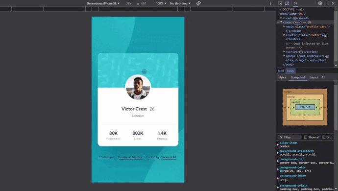

# Frontend Mentor - Profile card component solution

This is a solution to the [Profile card component challenge on Frontend Mentor](https://www.frontendmentor.io/challenges/profile-card-component-cfArpWshJ). Frontend Mentor challenges help you improve your coding skills by building realistic projects. 

## Table of contents

🔳 [The challenge](#the-challenge-muscle)

🔳 [Screenshots](#screenshot-camera)

🔳 [Links](#links-link)

🔳 [Built with](#built-with-hammer_and_pick)

🔳 [Author](#author-beginner)

## The challenge :muscle:

🎯 Build out the project to the designs provided

## Screenshots :camera:

## Links :link:

[Live site URL here](https://mendezpvi.github.io/fem-profile-card-component/) 👈

[Solution in Frontend Mentor here](https://www.frontendmentor.io/solutions/profile-card-component-using-flexbox-nfZ6a3-Lc8) 👈

## Built with :hammer_and_pick:

📌 Mobile-first workflow

📌 Semantic HTML5 markup

📌 CSS custom properties

📌 Flexbox

## Author :beginner:

✨ Frontend Mentor - [@mendezpvi](https://www.frontendmentor.io/profile/mendezpvi)

✨ X-Twitter - [@mendezpvi](https://x.com/mendezpvi)
